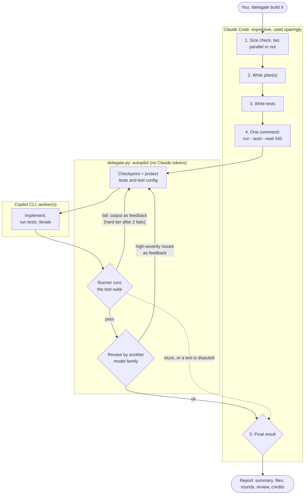
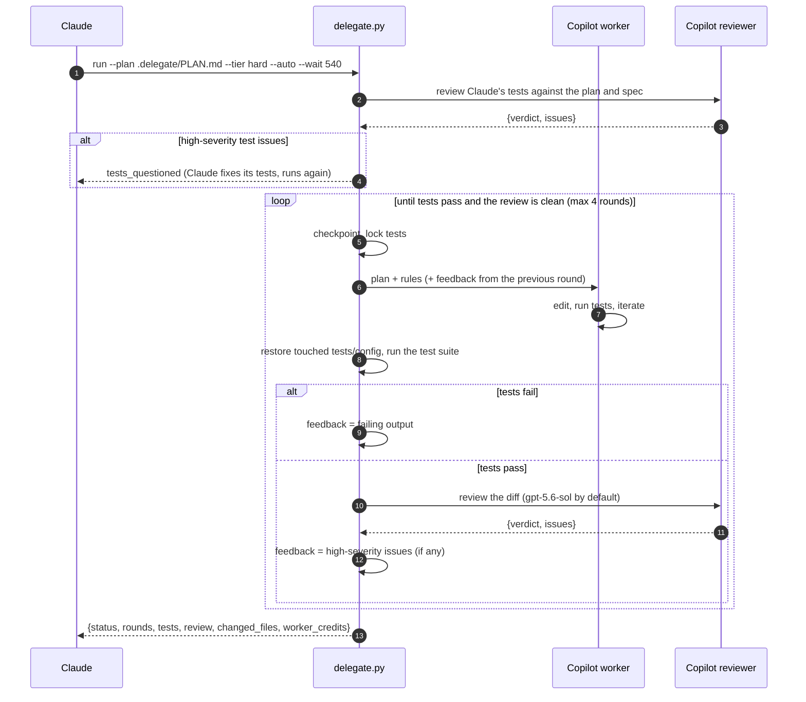
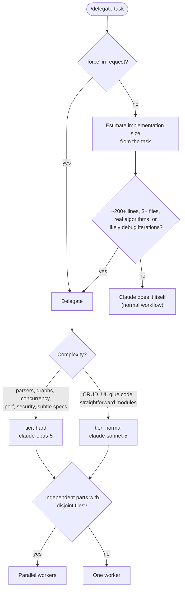
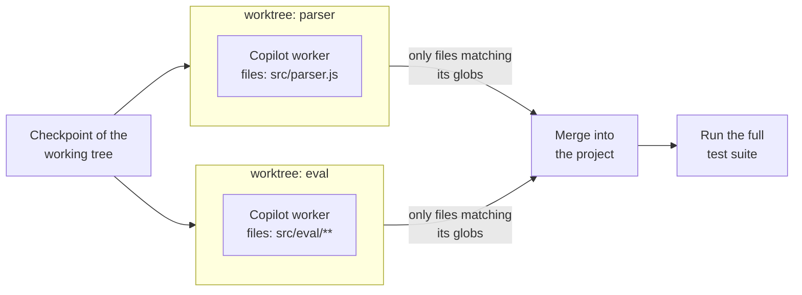
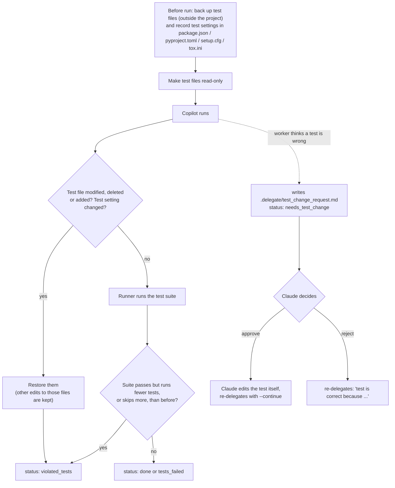
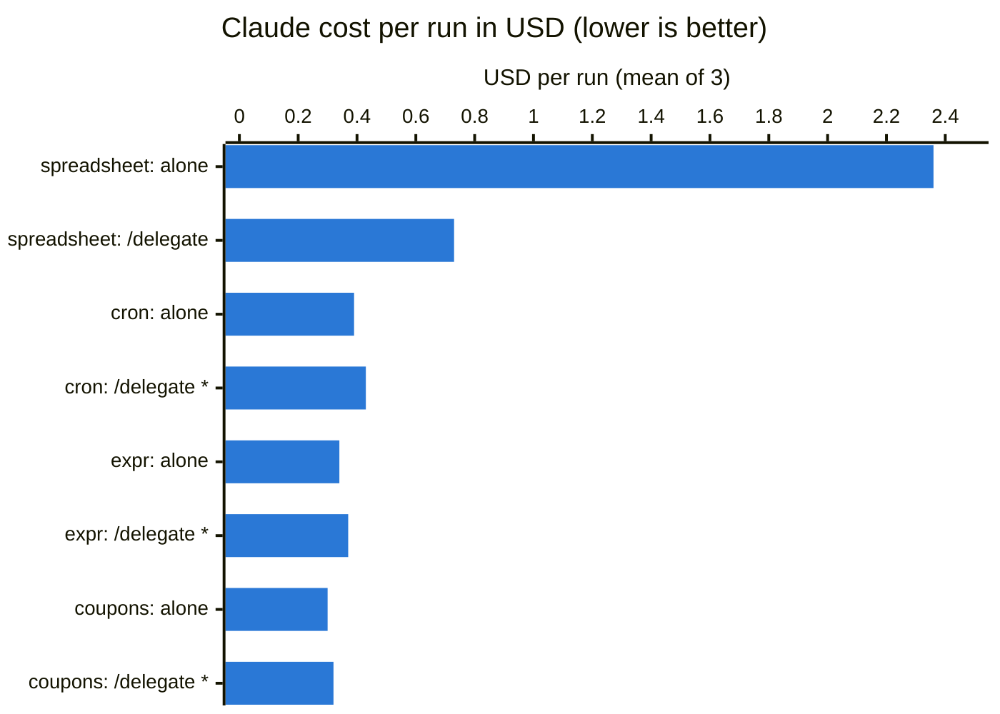

# claude-to-copilot-delegation

[](https://github.com/khangzxrr/claude-to-copilot-delegation/actions/workflows/tests.yml)

Cut Claude Code token usage by delegating implementation work to a cheaper coding agent
(GitHub Copilot CLI by default).

**Claude plans and verifies; the worker implements.** Claude writes a plan and the tests, hands the
work to Copilot, and then only looks at a small JSON status and the test results. It never reads the
implementation, so the expensive model spends tokens on the plan and the tests, not on code.

On a ~1,000-line task, delegating cut Claude's cost by **69%** ($2.36 → $0.73 per run, averaged
over 3 runs) with the same quality: every run passed all 42 hidden acceptance tests. On small tasks
the size check keeps the work with Claude, costing 4–9% more than not using the skill at all. See
[Benchmark results](#benchmark-results).

### What the Copilot reviewer does

Because Claude never reads the code, a second Copilot model (`gpt-5.6-sol` by default, a different
model family than the Claude workers) checks the work twice. It is read-only: it reports problems,
and never edits files.

| | 1. Test review | 2. Code review |
|---|---|---|
| **When** | before the first worker round | every time the tests pass |
| **Reads** | Claude's tests, the plan and the spec | the implementation diff since the task started (tests excluded), plus any repo file for context |
| **Looks for** | wrong tests (an expected value that contradicts the spec); missing tests | wrong behavior the tests miss, security problems, code that games the tests (not style) |
| **What happens to findings** | wrong tests go back to Claude to fix (it owns the tests); missing tests are only reported | high severity goes back to the worker for another round; medium is listed in Claude's report |

Details, the four-model comparison and costs: [Review](#review).

- [What the Copilot reviewer does](#what-the-copilot-reviewer-does)
- [How it works](#how-it-works)
- [Quick start](#quick-start)
- [When Claude delegates: size check](#when-claude-delegates-size-check)
- [Choosing the worker model: tiers](#choosing-the-worker-model-tiers)
- [Autopilot](#autopilot)
- [Test outlines](#test-outlines)
- [Parallel workers](#parallel-workers)
- [Background runs](#background-runs)
- [Checkpoints and undo](#checkpoints-and-undo)
- [Test protection](#test-protection)
- [Review](#review)
- [Watching Copilot live](#watching-copilot-live)
- [Run statuses and retries](#run-statuses-and-retries)
- [Configuration](#configuration)
- [Runner CLI reference](#runner-cli-reference)
- [Benchmark results](#benchmark-results)
- [Development](#development)
- [Project layout](#project-layout)
- [Limitations](#limitations)

---

## How it works



What each side sees:

| | Claude | Copilot |
|---|---|---|
| Reads | task, plan, tests, **one final JSON** | whole repo, plan, tests, feedback from the runner |
| Writes | `.delegate/PLAN.md`, a test outline (or the test files) | implementation code; test files from the outline (a separate session) |
| Runs tests | no need: the runner runs them after each round | yes: while iterating |
| May change tests | yes (it owns them) | **no**: only by asking Claude |

One delegation in detail:



## Quick start

Requirements: Python 3.10+, git (recommended), the tools for your project's tests, and
[GitHub Copilot CLI](https://docs.github.com/copilot/how-tos/copilot-cli) logged in (`copilot login`).

```sh
git clone https://github.com/khangzxrr/claude-to-copilot-delegation.git
cd claude-to-copilot-delegation
./install.sh                    # links the skill into ~/.claude/skills/ and a `delegate` command into ~/.local/bin/
```

`install.sh` is POSIX `sh`, so it runs the same from bash, zsh, fish or any other shell. Every
command in this README also works unchanged in all three.

Then, in any project, start a new Claude Code session:

```text
/delegate add a parseDuration("1h30m") -> seconds function in src/utils, throw on invalid input
```

Claude reports its decision first (for example
`Size check: ~900 lines, 5 modules → delegating (tier: hard, 2 parallel workers)`), then plans,
writes tests, and hands everything else to the autopilot in one command: worker rounds, test runs,
retries and a cross-family review. Use `/delegate force ...` to skip the size check.

## When Claude delegates: size check

Delegating has a fixed cost: loading the skill, writing a plan and tests, and extra turns. It only
pays off when the implementation is large. So Claude first estimates the size of the work from the
task alone, without reading the codebase.



| Claude does it itself | Claude delegates |
|---|---|
| under ~200 lines | ~200+ lines |
| 1-2 files | 3+ files or new modules |
| bug fix, rename, config, wiring | parsers, state machines, graphs, protocols |
| plan + tests would be as long as the code | likely to need several debug iterations |

## Choosing the worker model: tiers

Claude picks a **tier**, and the config maps it to a Copilot model, so you can remap tiers without
touching the skill.

| Tier | Default model | Used for |
|---|---|---|
| `normal` | `claude-sonnet-5` | most work; the default when unsure |
| `hard` | `claude-opus-5` | complex algorithms, tricky state, perf/security, subtle specs |

- **Escalation:** after two failed `normal` rounds in a row, the autopilot moves to `hard`.
- **Fallback:** if the `hard` model's run exits with an error (e.g. the model is not on your plan),
  the runner retries once with the `normal` model and reports `model_fallback`.
- Copilot bills per token in AI credits. On a trivial prompt Opus cost about 2.5x Sonnet. A
  ~1,000-line implementation cost ~130 credits on Opus; reviewing it with gpt-5.6-sol ~22.

## Autopilot

Every failed round or review finding used to come back to Claude, costing a turn that re-reads the
whole conversation. With `--auto` (the skill's default) the runner handles the loop itself and
hands back **one result**:

0. Before any worker round: with a [test outline](#test-outlines), a Copilot test writer first turns
   it into test files. Then a model of another family **checks the tests** against the plan
   and spec. **Wrong tests** (an expected value that contradicts the spec) go back to Claude
   (`tests_questioned`), which owns the tests; missing tests are only reported. This check repeats
   only when the tests change, so if Claude disagrees and reruns, the worker starts right away.
1. Run a worker round, then the test suite.
2. Tests fail → send the failing output back to the worker (`--continue` in the same Copilot
   session). After 2 failed rounds in a row, move to the `hard` tier.
3. Tests pass → a model of **another family** reviews the diff since the task started
   (`review_models`, default `gpt-5.6-sol`; the workers are Claude models, so reviewer and worker
   don't share blind spots).
4. High-severity issues → send them back to the worker, then test and review again.
5. Stop and hand back when: done, `auto_max_rounds` (4) is reached, a test is disputed
   (`needs_test_change`: Claude owns the tests), the worker touches tests twice, or a setup error.
   If the reviewer returns no verdict (twice), the result says `review.unverified`.

| Final status | Meaning |
|---|---|
| `done` | tests pass and the last review found no high-severity issue |
| `tests_questioned` | the test review found wrong tests; no worker round ran |
| `bad_outline`, `test_writer_error`, `no_tests_written` | the outline or the test writer failed; Claude fixes it |
| `review_concerns` | tests pass but high-severity issues remain after the allowed rounds |
| `tests_failed`, `violated_tests`, ... with `stopped_because` | stuck (e.g. `max_rounds`); Claude asks you what to do |
| `needs_test_change` | the worker disputes a test; Claude decides and runs again |

A real result from the benchmark: the first round passed the tests, the review found a
high-severity problem (huge ranges were expanded eagerly), round 2 fixed it, and the re-review
left one medium issue:

```json
{
  "status": "done",
  "summary": "Fixed the eager range expansion: ranges are now stored as bounds and iterated lazily over only the non-empty cells inside them (via a row index), for dependency tracking, cycle detection and evaluation, so =SUM(A1:A1000000000) is instant. All 15 tests in test/sheet.test.js pass.",
  "rounds": [
    {
      "round": 1,
      "status": "done",
      "tier": "hard",
      "model": "claude-opus-5",
      "tests": "15/15",
      "credits": 128.76
    },
    {
      "round": 2,
      "status": "done",
      "tier": "hard",
      "model": "claude-opus-5",
      "tests": "15/15",
      "credits": 213.71
    }
  ],
  "tests": {
    "passed": true,
    "cmd": "npm test",
    "counts": {
      "total": 15,
      "passed": 15,
      "failed": 0,
      "skipped": 0
    }
  },
  "changed_files": [
    "src/evaluator.js",
    "src/index.js",
    "src/parser.js",
    "src/references.js",
    "src/sheet.js",
    "src/tokenizer.js"
  ],
  "worker_credits": 342.47,
  "first_checkpoint": "20260919-160504-5042",
  "review": {
    "verdict": "concerns",
    "model": "gpt-5.6-sol",
    "issues": [
      {
        "severity": "medium",
        "file": "src/evaluator.js",
        "line": 258,
        "issue": "AND and OR skip empty cells in range arguments instead of coercing each empty value to FALSE, so formulas such as AND(TRUE,A1:A2) can return the wrong result."
      }
    ],
    "cycles": 2
  }
}
```

After a parallel round, failures in the merged result are fixed by single-worker rounds that get
all the parts' plans combined. `review.unverified` says when the final fix wasn't re-reviewed
because a limit was reached. Without `--auto`, each round returns on its own (manual mode).

## Test outlines

Tests are the largest thing Claude writes. So by default Claude writes a **test outline** instead of
test code: one line per case, with the exact input and expected result, grouped by test file:

```markdown
# Test outline
## test/sheet.test.js
- empty cell: new Sheet().get("A1") -> null
- formula: set A1="2", B1="=A1*3" -> get("B1") === 6
- invalid address: get("A0") -> throws Error
```

With `--test-outline .delegate/TESTS.md`, the autopilot starts with a **test writer**: a separate
Copilot session (`test_writer_model`, default `claude-sonnet-5`) that turns each line into a test.

- It may only write test files. Anything else it touches is reverted (`reverted_files`), and the
  files it writes are protected from the implementing worker like any other test, even if their
  names don't look like tests.
- The test review then checks the generated tests against the plan and spec. If it finds wrong
  tests, the test writer gets **one fix pass** (it may deviate from the outline where the outline
  contradicts the spec, and must say so in `notes`). Tests that are still wrong go back to Claude.
- The test writer runs again only when the outline changes. Claude fixes a test by editing its
  outline line.
- The result has `test_writer`: `files`, `cases` vs `outline_cases`, `notes`, `fix_pass`.

Claude still writes tests itself when a case needs setup too complex for one line.

## Parallel workers

When the work splits into parts with disjoint files and clear interfaces (for example tokenizer /
parser / evaluator), Claude can run several workers at once. Each works in its own **git worktree**
(a separate checkout outside the project), so they cannot step on each other.



Claude writes one plan per part and a manifest:

```json
{"tasks": [
  {"name": "parser", "plan": ".delegate/plans/parser.md", "files": ["src/parser.js", "src/tokenizer.js"],
   "tier": "hard", "test_cmd": "node --test test/parser.test.js"},
  {"name": "eval", "plan": ".delegate/plans/eval.md", "files": ["src/eval/**"]}
]}
```

- A worker's changes outside its `files` are **discarded** and listed as `out_of_scope_files`.
  If two parts change the same file, the second is reported under `conflicts`.
- Dependency folders (`node_modules`, `.venv`, `venv`) are linked into each worktree, so tests run
  without reinstalling.
- Each part should have its own test file(s) importing only that part (`test_cmd`), because the
  other parts don't exist in its worktree.
- Parallel rounds need a git repository.

## Background runs

A delegation can take longer than Claude Code's 10-minute limit on a single command. So the run
happens in a background process, and `--wait` waits for it within the same command:

```sh
delegate run --plan .delegate/PLAN.md --auto --wait 540   # the result, or {"status": "running"} after 9 min
delegate wait --timeout 540                               # keep waiting if it was still running
delegate run --plan .delegate/PLAN.md --background        # or: return at once with {"status": "started"}
```

Only one run per project can be active; a second `run` returns `busy`. If the runner process dies,
`wait` returns `crashed` with the end of its output.

## Checkpoints and undo

Before every round (and before `undo` and `review`) the runner saves a **checkpoint** of the
working tree. `undo` restores one:

```sh
delegate checkpoints          # list them
delegate undo                 # back to before the last round
delegate undo --to 20260919   # back to a specific checkpoint (id or prefix)
```

- In a git repository a checkpoint is a commit object built from a temporary index and kept under
  `refs/delegate/checkpoints/`. **Your branch, staging area and stash are never touched.** Ignored
  files (e.g. `node_modules`) are not included.
- Outside git it is a tarball in `.delegate/checkpoints/`.
- `undo` itself takes a checkpoint first, so an undo can be undone (`redo_checkpoint`).
- In a monorepo, only the project folder is checkpointed and restored.
- The last 20 checkpoints are kept (`keep_checkpoints`).

## Test protection

The worker may **run** tests but not **change** them. The prompt tells Copilot so, and the runner
enforces it:



- **Test settings:** `scripts.test`, `jest`, `mocha`, `ava`, `c8`, `nyc` in `package.json`, and the
  pytest sections of `pyproject.toml`, `setup.cfg` and `tox.ini`. Only those parts are restored; a
  dependency the worker added to `package.json` stays.
- **Test count:** the runner remembers the highest test count seen for the current set of test
  files. A passing suite that runs fewer tests, or skips more, is a violation. The history resets
  when Claude changes the tests. A failing suite is never flagged (a crash can hide tests).

Which files count as tests, and how the count is read, is auto-detected:

| Detected from | Test command | Protected files |
|---|---|---|
| `package.json` with a `test` script | `npm test` (or `pnpm` / `yarn` / `bun` by lock file) | `*.test.*`, `*.spec.*`, `__tests__/`, `test/`, `tests/`, jest/vitest/mocha config |
| pytest (`pyproject.toml`, `pytest.ini`, `conftest.py`, `tests/`) | `python3 -m pytest -q` (or `uv run` / `poetry run` / `.venv`); **`python3 -m unittest discover` when pytest isn't installed** | `test_*.py`, `*_test.py`, `conftest.py`, `tests/`, `pytest.ini` |
| `go.mod` | `go test -v ./...` | `*_test.go`, `testdata/` |
| `Cargo.toml` | `cargo test` | `tests/` |
| `Makefile` with `test:` | `make test` | `tests/`, `test/` |

Test counts are parsed from node:test, jest, vitest, mocha, pytest, unittest, go test and cargo output.

## Review

There are two reviews, both by a model of **another family** than the workers (set by
`review_models`), both read-only.

What the **code review** checks, and what it doesn't:

- It sees a diff of all implementation changes since the task started (tests excluded), and can
  read any file in the repository for context or run commands to confirm a problem.
- It reports only: clearly wrong behavior the tests miss (crashes on valid input, data loss, wrong
  results), security problems (injection, path traversal, unsafe deserialization, secrets, missing
  auth checks), and code that games the tests (hardcoded expected values, special-cased inputs).
- It does not report style, naming or small improvements.
- It must not edit files; if it does, the runner restores them and says so in `note`.
- High-severity issues go back to the worker; medium ones are passed on in Claude's report.

What the **test review** checks: it works out every expected value in Claude's tests from the plan
and spec, checks the tests against each other, and lists requirements with no test. A wrong test
stops the run before any worker round (`tests_questioned`); missing tests are only reported.

| | Test review | Code review |
|---|---|---|
| When | once before the first worker round (again only if the tests change) | every time the tests pass |
| Checks | Claude's tests against the plan and spec: the reviewer works out each expected value itself and checks the tests against each other; also lists missing tests | the implementation diff since the task started: wrong behavior, security, test-gaming |
| Blocking findings | wrong tests, back to Claude (`tests_questioned`); missing tests are only reported | high severity, back to the worker (another round) |
| By hand | `delegate review --tests` | `delegate review --tier hard` |

Why review the tests at all: Claude never reads the code, so the tests are the whole contract. In
the benchmark Claude wrote the same kind of wrong test in 3 of 6 cron runs: it expected
`0 0 29 2 MON` to fire on a Monday outside February. Each time that cost worker rounds before the
worker disputed it. Given those original test files, the test review (`gpt-5.6-sol`, 23–34 credits)
flagged the wrong test with the correct expected value in 5 of 6 attempts, with no false alarms.

Which reviewer? All four candidates reviewed **the same** ~1,000-line spreadsheet implementation
(from a benchmark run that had passed all 42 hidden tests):

| Reviewer | Credits | What it found |
|---|---|---|
| `gpt-5-mini` | 1.8 | a vague "large ranges could be slow" note; **missed the real bug** |
| `gpt-5.5` | 32.6 | the real bug: formulas over ranges of 1M+ cells skip cycle detection (medium) |
| **`gpt-5.6-sol`** (default) | 21.8 | the same bug, rated **high**, so the autopilot sends it back for a fix |
| `gpt-6-astra` | 98.6 | the same bug, plus `ROUND(1.005, 2)` float rounding and row numbers above 2^53 colliding |

For the most thorough reviews set `"review_models": {"hard": "gpt-6-astra"}`.

## Watching Copilot live

The runner streams Copilot's JSON events and turns them into a readable log as they arrive, at
`.delegate/logs/latest.log`. Claude only receives the final JSON, so watching costs no Claude tokens.
Parallel workers are interleaved with a `[name]` prefix. An autopilot run opens one live-view
window that follows all its rounds and reviews (`delegate watch --run <run_id>`).

```text
=== delegate run 2026-09-19 11:25:29 · tier normal · new session · checkpoint 20260919-112529-8e70
=== model: claude-sonnet-5
11:25:42 ▸ create src/slugify.js
11:25:42   ✗ create failed: Parent directory does not exist
11:25:46 ▸ bash mkdir -p src
11:25:49 ▸ create src/slugify.js
11:25:52 ▸ bash cd . && npm test
         │ ok 1 - lowercases and joins with dashes
11:25:55 💬 All 5 tests pass.
=== runner: running the test suite
=== end: done · 29s · 1 files changed · AI credits 6.80
```

- **A window per run (automatic):** set `"live_view": "auto"` in `~/.config/delegate/config.json`.
  Each run opens a terminal that follows its log and waits for Enter when it finishes. `auto` uses a
  tmux split when inside tmux, otherwise `$TERMINAL`, then the first of alacritty, kitty, wezterm,
  ghostty, foot, konsole, gnome-terminal or xterm that is installed. Or give an argv with a `{cmd}`
  placeholder: `"live_view": ["konsole", "--hold", "-e", "{cmd}"]`.
- **A terminal you open yourself:** `delegate watch` in the project follows the latest run and
  switches to each new one (Ctrl-C to stop).

To suppress windows for one command, set `DELEGATE_LIVE_VIEW=off` in its environment, e.g.
`env DELEGATE_LIVE_VIEW=off delegate run ...` (works in every shell; the benchmark does this).

## Run statuses and retries

In autopilot, Claude only sees the final status (see [Autopilot](#autopilot)). These are the
statuses of a single round, which the autopilot acts on, and which Claude sees in manual mode:

| Status | Meaning | Autopilot's next step |
|---|---|---|
| `done` | the runner's test run passed | review |
| `tests_failed` | the runner's test run failed (`tests.output_tail`) | retry with the output as feedback |
| `needs_test_change` | worker thinks a test is wrong (`test_change_request`) | hand back to Claude |
| `violated_tests` | tests or test config touched (restored), or fewer tests ran | retry once, then hand back |
| `failed` / `no_report` / `timeout` | worker gave up, didn't report, or ran out of time | retry |
| `backend_error` / `runner_error` / `crashed` | setup problem (`log_tail` / `error`) | hand back |
| `started` / `running` / `busy` | background bookkeeping | Claude keeps calling `wait` |

A single round's JSON (manual mode) looks like:

```json
{
  "status": "done",
  "summary": "Implemented src/slugify.js with diacritic stripping; all 5 tests pass.",
  "worker_reported": "done",
  "changed_files": ["src/slugify.js"],
  "tests": {"passed": true, "cmd": "npm test", "counts": {"total": 5, "passed": 5, "failed": 0, "skipped": 0}},
  "tier": "normal",
  "model": "claude-sonnet-5",
  "seconds": 29,
  "checkpoint": "20260919-112529-8e70",
  "log": ".delegate/logs/run-20260919-112529-417.log",
  "worker_credits": 6.8,
  "run_id": "20260919-112529-1f3a"
}
```

Other fields that can appear: `model_fallback`, `violations`, `test_change_request`, `log_tail`,
`live_view_error`, `warning`; parallel rounds add `tasks` (per worker: `status`, `applied_files`,
`out_of_scope_files`, `conflicts`, `worker_credits`, ...).

## Configuration

Settings are read from `~/.config/delegate/config.json` (all projects), then from the project's
`.delegate/config.json`, which wins. Everything is optional.

| Key | Default | Meaning |
|---|---|---|
| `backend` | `copilot` | `copilot`, or `command` for any other agent CLI |
| `models` | `{"normal": "claude-sonnet-5", "hard": "claude-opus-5"}` | model per tier (`copilot help config` lists names) |
| `model` | `null` | pin one model for every tier (disables tier selection) |
| `timeout` | `1800` | seconds per worker run |
| `builtin_mcps` | `false` | keep Copilot's built-in GitHub MCP server (workers don't need it; off saves about 7% per request) |
| `extra_args` | `[]` | extra flags passed to the backend CLI |
| `command` | `null` | argv for the `command` backend; the prompt is in `$DELEGATE_PROMPT`, and it must write `.delegate/result.json` |
| `test_cmd` | auto | override the detected test command |
| `test_globs` | auto | override the detected protected test paths |
| `extra_protected` | `[]` | extra protected paths on top of the detected ones |
| `count_tests` | `true` | flag a passing suite that runs fewer tests than before |
| `review_models` | `{"normal": "gpt-5.6-sol", "hard": "gpt-5.6-sol"}` | reviewer per tier (another model family than the worker) |
| `review_model` | `null` | pin one reviewer for every tier |
| `auto_max_rounds` | `4` | autopilot: worker rounds before handing back to Claude |
| `auto_review` | `true` | autopilot: review when the tests pass and send high-severity issues back |
| `auto_review_cycles` | `2` | autopilot: maximum code reviews per run |
| `review_tests` | `true` | autopilot: review Claude's tests against the plan before the first round |
| `test_writer_model` | `claude-sonnet-5` | writes test files from Claude's outline (`--test-outline`) |
| `keep_checkpoints` | `20` | how many checkpoints to keep |
| `live_view` | `null` | `"auto"` opens a terminal following each run's live log; or an argv containing `"{cmd}"` |

Everything the runner writes lives in `.delegate/`, which gets its own `.gitignore`.

## Runner CLI reference

Claude runs these for you; they are also handy by hand. Every command prints one JSON object.
`delegate` is the command `install.sh` links into `~/.local/bin/`; if that isn't on your `PATH`,
use `python3 ~/.claude/skills/delegate/delegate.py` instead (same arguments, any shell).

```sh
delegate detect                                             # test command, protected files, models, git
delegate run --plan .delegate/PLAN.md --test-outline .delegate/TESTS.md --tier hard --auto --wait 540
delegate run --parallel .delegate/parallel.json --auto --wait 540
delegate wait --timeout 540                                          # if it was still running
delegate run --plan .delegate/PLAN.md --continue --feedback-file .delegate/feedback.md   # manual round
delegate test                                               # run the suite: {passed, counts, output_tail}
delegate review --tier hard                                 # cross-family review of the task's changes
delegate review --tests                                     # review the tests against .delegate/PLAN.md
delegate checkpoints                                        # list checkpoints
delegate undo                                               # restore the one before the last round
delegate watch                                              # follow the live log (--run ID: one autopilot run)
```

| `run` option | Meaning |
|---|---|
| `--plan FILE` / `--parallel MANIFEST` | one worker on a plan, or several on a manifest |
| `--tier normal\|hard` | complexity tier, mapped to a worker and a reviewer model (default `normal`; per task in a manifest) |
| `--model NAME` | explicit model for this run, overrides tier and config |
| `--continue` | resume the previous worker session(s) (keeps their context across retries) |
| `--feedback-file PATH` / `--feedback TEXT` | feedback for a retry. Prefer a file (`-` reads stdin): test output full of quotes, `$` and backticks passes through untouched in any shell |
| `--auto` | autopilot: retry failing tests, review, fix high-severity issues; return once done or stuck |
| `--test-outline FILE` | autopilot: a Copilot test writer turns this outline into test files first |
| `--wait S` | run in the background and wait up to S seconds in the same call (`running` after that) |
| `--background` | return immediately; collect the result with `wait` |

Exit codes: `0` for `done`/`started`, `3` for `running` (from `wait` or `--wait`), otherwise non-zero.

**Shells.** The runner never goes through your interactive shell: workers, git, background runs and
live-view terminals are started directly. The one exception is the test command, which always
runs with `/bin/sh` (so `test_cmd` in the config should be POSIX `sh` syntax).

## Benchmark results

Each task was run 3 times by Claude alone (`"Implement TASK.md"`) and 3 times with `/delegate`,
using the same Claude model (Opus 5) and tools. Quality was measured with **hidden acceptance tests**
that neither side saw. Values are means over the 3 runs (2026-09-19).



How to read it: each pair of bars is the same task, done by Claude alone and with `/delegate`.

- **spreadsheet (~1,000 lines):** the task was delegated to Copilot, and Claude's cost fell from
  $2.36 to $0.73 (-69%). With [test outlines](#test-outlines) it fell further, to $0.66.
- **\* the three small tasks (~60-200 lines):** the [size check](#when-claude-delegates-size-check)
  decided they were too small to delegate, so Claude did them itself. The few extra cents (+4-9%)
  are the cost of loading the skill and making that decision, not a loss from delegating.


| Task | Size | What `/delegate` did | Claude alone | Claude + `/delegate` | Change | Copilot credits | Hidden tests |
|---|---|---|---|---|---|---|---|
| cart-coupons (existing code) | ~60 lines | size check: Claude did it | $0.30 | $0.32 | +4% | 0 | all passed |
| expr-eval (new module) | ~200 lines | size check: Claude did it | $0.34 | $0.37 | +8% | 0 | all passed |
| cron (Python package) | ~200 lines | size check: Claude did it | $0.39 | $0.43 | +9% | 0 | all passed |
| spreadsheet (multi-module) | ~1,000 lines | delegated: 1 round, tier hard (Opus), review ok | **$2.36** | **$0.73** | **-69%** | 140 | all passed |

- **Where the savings come from: turns.** Alone, Claude took 26–43 turns on the spreadsheet, each
  re-reading a growing context (1.24M cache-read tokens on average). Delegating, it took 8–10
  (273k), because Copilot's edit-and-debug loop never enters Claude's context. Claude's output
  tokens dropped from 40.9k to 10.8k.
- **Small tasks cost a little more** because of loading the skill and making the size decision.
  Forcing delegation on cron (`/delegate force`) didn't help either: Claude cost $0.43 (+11%) plus
  about 20 Copilot credits, and it took 3.3 minutes instead of 1.
- **Time:** about the same on the spreadsheet (504s vs 490s alone).
- **Copilot credits** are listed separately: the dollar value of a credit depends on your plan.

### Autopilot (3 runs each, 2026-09-19)

| Task | Mode | Claude cost | Claude turns | Copilot credits (worker rounds) | Hidden tests |
|---|---|---|---|---|---|
| spreadsheet | delegate, before autopilot | $0.73 ($0.66–$0.80) | 9 (8–10) | 140 | 126/126 |
| spreadsheet | delegate, **autopilot** | $0.78 ($0.73–$0.85) | 8 (7–9) | 200 (126–342) | 126/126 |
| cron | force, before autopilot | $0.43 ($0.41–$0.48) | 6 | 20 | 66/66 |
| cron | force, **autopilot** | $0.50 ($0.44–$0.56) | 11 (9–13) | 78 (46–112) | 66/66 |

- **Claude's cost stayed about the same** (within the run-to-run spread). In these tasks the first
  round usually passed, so there were few retries to take off Claude's hands; Claude's cost is
  dominated by writing the plan and the tests.
- **What autopilot added was quality, paid in Copilot credits.** The cross-family review found real
  problems that the hidden tests didn't cover. In one spreadsheet run it flagged a high-severity
  issue and the worker fixed it in a second round, with no Claude turns. That fix round cost 214
  credits (a resumed Opus session carries its whole context).
- **Cron:** in 2 of 3 runs the worker correctly **disputed a wrong test Claude had written**
  (`0 0 29 2 MON` can't fire in March). The runner handed the dispute back, Claude fixed its
  test, and the rerun passed. That is where the extra Claude turns came from.
- The credits above count worker rounds only: a bug (since fixed) dropped the review's usage
  events for GPT models. A `gpt-5.6-sol` review of the spreadsheet costs ~22 credits.

### Test outlines (3 runs each)

With Claude writing a test outline instead of test code, the spreadsheet delegation cost **$0.66**
instead of $0.78 (-15%) and produced **76–95 tests instead of 13–15**. On cron, Claude's cost was
flat ($0.49 vs $0.47) because it wrote more cases, which gave 61–95 tests instead of 10–19. All
hidden tests passed. Copilot's credits rose about 45%, and runs took longer.

Details, per-run numbers, methodology and how to add tasks: [docs/benchmark.md](docs/benchmark.md).

### Live demo: side by side

`bench/demo.py` runs Claude alone and Claude + `/delegate` on the same task at the same time, in
one terminal screen: Claude's turns and tokens as they happen, what Claude and Copilot are doing,
and at the end Claude's cost and Copilot's cost (AI credits at $0.01 each; `--credit-usd` to change),
with a bar comparison. When both runs finish, the screen switches to the result: every hidden
acceptance test passed or failed per run, and the files each run wrote. Every run is recorded in
`bench/demo-runs/`, and a replay calls no model.

```sh
pip install rich
python3 bench/demo.py                          # live, spreadsheet task (~8 min)
python3 bench/demo.py --task cron --modes alone force
python3 bench/demo.py --replay --speed 4       # replay the latest recording, 4x faster
```

Keys: `v` switch between the result and the activity, `r` run again, `p` replay the latest
recording, `q` quit (stops the runs).

## Development

The runner has a test suite that needs no network and no Copilot account: a fake `copilot`
(`tests/fake_copilot.py`) plays worker, test writer and reviewer from small bash scenarios in
`tests/scenarios/`. It covers the test guard, background runs, undo, parallel merges, both reviews,
the autopilot loop, test outlines, Python/no-git/monorepo projects, and the documented commands in
bash, zsh and fish (shells that aren't installed are skipped).

```sh
python3 -m unittest discover -s tests -v    # ~45 s; needs git, node/npm, python3
```

Each test runs in a temporary directory with its own `HOME`, so your own config and
`~/.claude` are never touched. GitHub Actions runs the suite on Python 3.10 and 3.12
(`.github/workflows/tests.yml`).

## Project layout

```text
claude-to-copilot-delegation/
├── install.sh                  # POSIX sh: links the skill + a `delegate` command
├── skills/delegate/
│   ├── SKILL.md                # the /delegate workflow Claude follows
│   ├── delegate.py             # CLI: run (single/parallel/background), wait, test, review, undo, watch
│   ├── common.py               # config, file hashing, git helpers
│   ├── detect.py               # test framework detection, test counts, test-config fragments
│   ├── guard.py                # test protection
│   ├── checkpoint.py           # checkpoints, undo, worktrees
│   └── livelog.py              # live log, worker process runner, live-view terminals
├── tests/                      # unittest suite with a fake copilot (tests/fake_copilot.py, tests/scenarios/)
├── .github/workflows/tests.yml # CI: the suite on Python 3.10 and 3.12
├── bench/
│   ├── run.py                  # benchmark harness: alone vs delegate
│   ├── demo.py                 # live side-by-side demo TUI, with record and replay
│   ├── tasks/<name>/repo/      # starting project + TASK.md
│   ├── tasks/<name>/hidden/    # acceptance tests, never shown to agents
│   └── results/<timestamp>/    # summary.md, results.json, each run's working copy
└── docs/benchmark.md
```

## Limitations

- **Tests are protected by path and known settings.** Rust inline `#[cfg(test)]` modules and
  unusual test setups (e.g. a custom runner script) are not guarded; add paths with `extra_protected`.
  The test-count check still catches a passing suite that runs fewer tests.
- **The worker runs with `--allow-all-tools`.** Checkpoints make every round undoable, but workers
  can still run arbitrary commands on your machine.
- **Claude trusts the tests and the reviews, not the code.** The reviews catch a lot (in the
  comparison, `gpt-5.6-sol` found a real bug that passed all 42 hidden tests), but not everything:
  `gpt-6-astra` found two more in the same code. For anything important, read `git diff` yourself
  (it costs no Claude tokens).
- **Copilot CLI's account may differ from `gh`'s.** Check model availability with
  `copilot -p "reply ok" --model <name>`, not the GitHub API.
